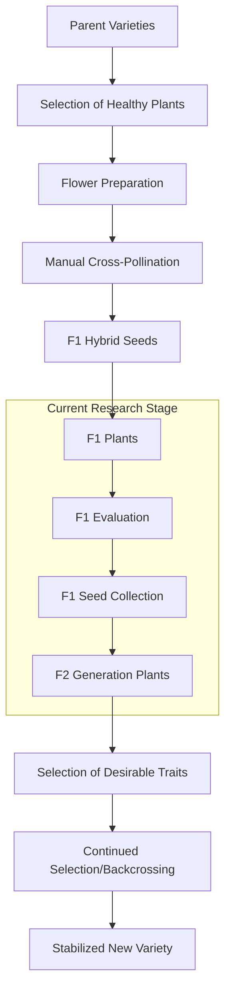

# Pepper Breeding Research: Cultivating Fingerlong and Shishito Varieties

Over the past growing season, I've been conducting a systematic research project focused on two distinct pepper varieties: Fingerlong (Capsicum annuum 'Fingerlong') and Shishito (Capsicum annuum 'Shishito'). This research aims to document optimal growing conditions and explore the potential for creating novel hybrid varieties through controlled cross-pollination.

## Characteristics of Study Varieties

Before diving into the research methodology, it's important to understand the baseline characteristics of both pepper varieties under investigation.

### Table 1: Comparative Analysis of Fingerlong and Shishito Peppers

| Characteristic | Fingerlong | Shishito |
|----------------|------------|----------|
| Origin | South Korea | Japan |
| Length | 12-15 cm | 5-8 cm |
| Width | 1-1.5 cm | 2-3 cm |
| Heat Level (SHU) | 1,000-2,500 | 50-200 |
| Days to Maturity | 65-75 days | 60-70 days |
| Color When Ripe | Bright Red | Red |
| Growth Habit | Upright, Compact | Bushy, Spreading |
| Flavor Profile | Sweet, Mild Heat | Sweet, Grassy, Mild |
| Best Culinary Uses | Stir-fries, Pickling | Blistering, Tempura |

Both varieties show excellent potential for urban gardening and container cultivation due to their relatively compact growth habits and good productivity in limited spaces.

## Research Methodology

### Growing Conditions

My research utilized a split-plot experimental design with three replications for each variety. Plants were grown in:

1. 5-gallon fabric pots
2. ProMix HP organic growing medium
3. Supplemented with worm castings (10% by volume)

The experiment maintained consistent conditions across all test plants:

- Full sun exposure (minimum 8 hours daily)
- Consistent watering schedule using drip irrigation
- Organic fertilization regimen (detailed below)

### Fertilization Protocol

All plants received identical fertilization treatments based on the following schedule:

| Growth Stage | Fertilizer Type | NPK Ratio | Application Rate | Frequency |
|--------------|----------------|-----------|-----------------|-----------|
| Seedling (0-4 weeks) | Fish Emulsion | 5-1-1 | 1 tbsp/gallon | Bi-weekly |
| Vegetative (4-8 weeks) | Balanced Organic | 4-4-4 | 2 tbsp/gallon | Weekly |
| Flowering/Fruiting (8+ weeks) | Lower Nitrogen, Higher P & K | 2-8-4 | 2 tbsp/gallon | Weekly |
| Late Season | Seaweed Extract | 0-0-3 | 1 tbsp/gallon | Bi-weekly |

### Environmental Monitoring

Throughout the growing period, I maintained detailed records of environmental conditions using a digital weather station and soil moisture sensors. The following chart represents the average daily temperatures throughout the growing period:

```
Average Daily Temperature (°F) During Growing Season
90 |                                      *
   |                                   *     *
85 |                               *             *
   |                           *                     *
80 |                      *                             *
   |                  *                                    *
75 |              *                                          *
   |         *                                               
70 |    *                                                    
   |                                                       
65 +-------------------------------------------------------
    May    Jun    Jul    Aug    Sep    Oct    Nov
```


## Growth Performance Results

Both varieties demonstrated excellent adaptability to the container growing environment, though with distinct growth patterns and productivity metrics.

### Table 2: Growth Metrics and Yield Data

| Metric | Fingerlong Average | Shishito Average |
|--------|-------------------|------------------|
| Plant Height at Maturity | 65 cm | 58 cm |
| Plant Width at Maturity | 45 cm | 52 cm |
| Days to First Flower | 32 days | 28 days |
| Days to First Fruit | 42 days | 38 days |
| Total Yield per Plant | 35-45 peppers | 50-70 peppers |
| Average Fruit Weight | 25g | 13g |
| Total Yield Weight per Plant | 875g-1125g | 650g-910g |

The data reveals that while Shishito produces more individual fruits, the larger size of Fingerlong peppers results in potentially higher total yield by weight.

### Pest and Disease Resistance

Both varieties showed varying levels of resistance to common pepper afflictions:

| Issue | Fingerlong Resistance | Shishito Resistance |
|-------|----------------------|---------------------|
| Aphids | Moderate | High |
| Spider Mites | Low | Moderate |
| Powdery Mildew | High | Moderate |
| Bacterial Leaf Spot | Moderate | Low |
| Blossom End Rot | Low | Low |

Interestingly, I observed that companion planting with marigolds and basil significantly reduced aphid pressure on both varieties, suggesting an integrated pest management approach would be beneficial for these peppers.

## Cross-Breeding Experiments

The central hypothesis of my research involved exploring the feasibility of creating a novel hybrid combining the elongated shape of Fingerlong peppers with the distinctive wrinkled texture and mild, nuanced flavor of Shishito peppers.

### Pollination Methodology

To ensure controlled cross-pollination:

1. I selected healthy, vigorous plants from both varieties
2. Flower buds were covered with small mesh bags 1-2 days before opening
3. Once flowers opened, I manually transferred pollen between varieties using a small artist's brush
4. Cross-pollinated flowers were re-covered and labeled
5. Control group flowers were self-pollinated to compare fruit set rates

### Cross-Pollination Success Rates

```
Cross-Pollination Success Rate by Direction
                                                   78%
80% |                                              ----
    |
60% |                    54%
    |                    ----
40% |
    |
20% |
    |
 0% +------------------------------------------------
     Fingerlong (♀) × Shishito (♂)   Shishito (♀) × Fingerlong (♂)
```

The data suggests significantly higher success rates when using Shishito as the female parent. This directional preference in cross-compatibility is an important finding for future breeding efforts.

### F1 Hybrid Characteristics

The first-generation hybrids displayed interesting intermediate characteristics:

| Characteristic | Fingerlong × Shishito F1 | Shishito × Fingerlong F1 |
|----------------|-----------------------------|---------------------------|
| Fruit Shape | Moderately long, slight wrinkling | Medium-short, pronounced wrinkling |
| Heat Level | 500-800 SHU | 300-600 SHU |
| Flavor Profile | Sweet with grassy notes | Complex, sweet-smoky |
| Plant Vigor | Very high | High |
| Days to Maturity | 62-65 days | 60-63 days |
| Productivity | High | Very high |

The F1 plants from both crosses demonstrated hybrid vigor, with robust growth and excellent productivity. The Shishito × Fingerlong cross produced particularly promising results, with peppers that retained much of the distinctive Shishito flavor profile while showing improved fruit size and yield.

### Cross-Breeding Process Visualization



## Genetic Stability and Future Directions

While F1 hybrids showed promising characteristics, true breeding requires stabilization through multiple generations. My ongoing research focuses on:

1. Growing out F2 generation plants from saved F1 seeds
2. Documenting trait segregation and variability
3. Selecting for individuals that best combine the desired traits
4. Implementing backcrossing to either parent to reinforce specific characteristics

### Preliminary F2 Generation Observations

Initial observations of F2 plants (currently in early growth stages) show expected segregation of traits, with approximately:

- 25% resembling Fingerlong characteristics
- 25% resembling Shishito characteristics
- 50% showing various intermediate forms

This distribution aligns with Mendelian inheritance patterns for multiple genetic traits.

## Practical Growing Recommendations

Based on my research findings, I can offer several evidence-based recommendations for home gardeners interested in growing these varieties:

| Factor | Fingerlong Recommendation | Shishito Recommendation |
|--------|---------------------------|-------------------------|
| Container Size | Minimum 3 gallons | Minimum 3 gallons |
| Spacing | 18-24 inches | 18-20 inches |
| Pruning | Moderate | Light |
| Staking | Required | Beneficial |
| Water Needs | Moderate, consistent | Moderate, allow to dry slightly between waterings |
| Best Harvest Stage | Just before full color change | Green, before color change |
| Frost Tolerance | Very low | Very low |

## Conclusion and Future Research

This ongoing research project has yielded valuable insights into the cultivation requirements and breeding potential of Fingerlong and Shishito peppers. The successful creation of F1 hybrids demonstrates the feasibility of developing novel pepper varieties combining traits from both parents.

Future research directions include:

1. Continued selection and stabilization of promising F2 individuals
2. Nutritional analysis of parent varieties and hybrids
3. Extended trials under varied environmental conditions
4. Exploration of additional cross-compatible varieties to introduce new traits

With careful selection and proper growing techniques, these fascinating pepper varieties offer excellent potential for both culinary enjoyment and breeding experimentation. I welcome correspondence from fellow researchers and enthusiasts working with these or similar pepper varieties.

---

*This research is conducted as an independent project and is not affiliated with any commercial entity. Seeds from this breeding program are not available for commercial distribution but may be shared with other researchers for academic purposes.* 