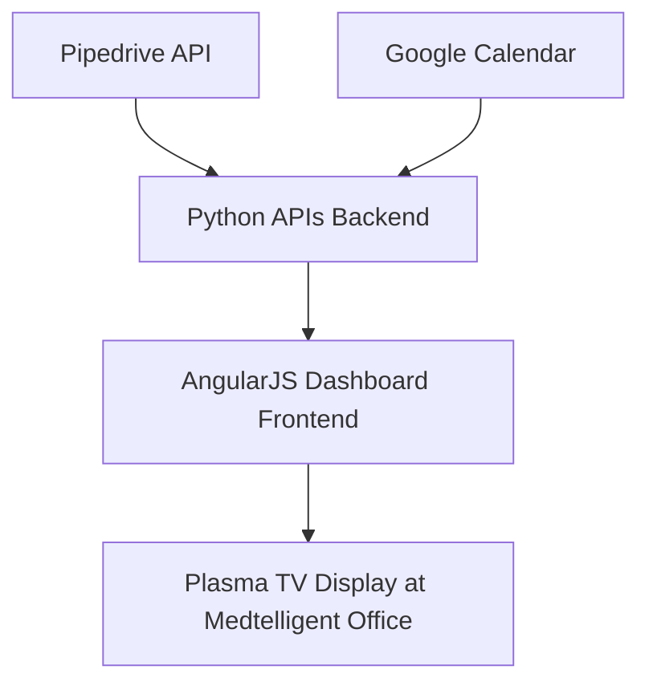

# My Summer Internship at Medtelligent

During the summer of 2014, I had the incredible opportunity to intern at **Medtelligent** in Chicago, IL. Medtelligent is the creator of **ALIS** (Assisted Living Intelligent Solutions), a software platform designed to streamline operations at assisted living facilities across the country. Their focus on automating daily tasks and improving nursing practices makes a real difference in the lives of caregivers and residents alike.

Throughout my internship, I was immersed in a fast-paced environment where new features were added monthly, daily support was provided, and marketing data was actively gathered and analyzed. I had the chance to contribute to each of these areas in a meaningful way, helping to improve internal processes and the quality of support provided to clients.

My primary project involved designing and developing an **interactive dashboard** to display live updates for the Medtelligent team. Using **AngularJS**, **UnderscoreJS**, **Packery**, and **RequireJS**, I built a dynamic and responsive framework that allowed staff members to stay informed in real-time. I also created efficient APIs using **Python** to power the dashboard’s widgets and ensure smooth data delivery. Special attention was given to creating a user-friendly interface that was both visually appealing and intuitive to navigate.

## System Architecture Diagram

Here’s a simple overview of how the dashboard system worked:

Data flowed from internal tools like Pipedrive, Google Calendar, Salesforce, Jira, and Freshdesk through custom-built APIs into an AngularJS dashboard, updating in real-time on a dedicated office display.

## Technology Skills Overview

| Technology | Purpose |
| :--- | :--- |
| AngularJS | Frontend dashboard framework |
| UnderscoreJS | Data manipulation within widgets |
| Packery | Layout management for draggable widgets |
| RequireJS | JavaScript module loader |
| Python | Backend API development |
| HTML/CSS | Interface structure and styling |
| WordPress CMS | Website content management and updates |

---

The dashboard I created is now proudly displayed on a plasma screen in their main office, serving as a central hub for company updates, support ticket stats, upcoming events, lunch meetings, weather reports, and more.

In addition to technical development, I also provided **technical support** for website bugs, content updates, and various web applications managed through WordPress CMS.

One of the most valuable takeaways from my internship was improving my **time management skills**. Committing ten hours a day to professional work during my time off from school helped me become more disciplined, organized, and better prepared for future challenges.

I'm incredibly grateful to the Medtelligent team for the opportunity to grow my technical skills, contribute to meaningful projects, and be part of a company that’s truly making a positive impact in healthcare.

---

**Company:** Medtelligent  
**Website:** [www.medtelligent.com](http://www.medtelligent.com)  
**Location:** Chicago, IL  
**Position:** Summer Intern  
**Dates:** May 2014 – July 2014

**Key Responsibilities:**
- Provided technical support for bugs, content changes, and web applications using WordPress CMS
- Designed and developed an interactive dashboard for live updates using HTML, CSS, and JavaScript (AngularJS, UnderscoreJS, Packery, RequireJS)
- Built dashboard and individual widget APIs using Python
